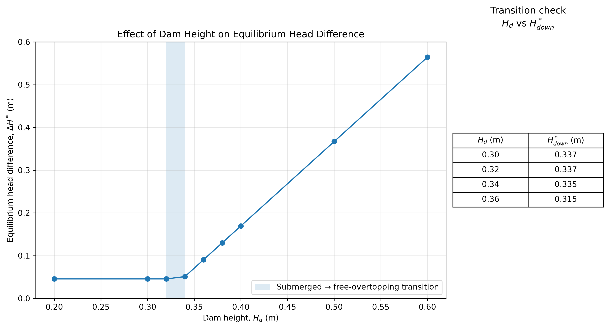
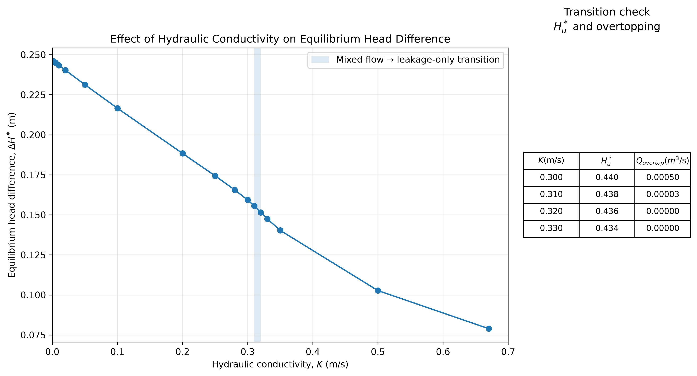

# Beaver Dam Modelling Project

A Python/Pygame modelling project combining beaver foraging and dam construction with a simplified hydraulic model of leakage, overtopping and upstream/downstream water balance.

The final model was used to run controlled experiments on dam height and hydraulic conductivity, and then to understand the resulting patterns using the governing equations.

## Where the project came from

This project actually started from a question that was quite different from where it ended up.

I was wondering whether beavers deliberately make trees fall in a useful direction — for example towards the river — so that moving the wood afterwards takes less effort. I originally imagined the project being mainly about tree cutting, direction and transport.

Once I started trying to turn that idea into a model, though, I realised that there were a lot of other decisions hiding inside it. Which tree should the beaver choose? How should distance, tree size and species preference matter? How should the material actually contribute to the dam?

That led me to build a small environment with a river, randomly generated trees and a beaver that could select, cut and transport usable wood.

But after getting that part to work, I started to feel that I was mostly building behaviour and animation rather than something I could really investigate mathematically. That was when the focus of the project began to shift.

Instead of only asking how the dam gets built, I started asking:

**once the dam exists, what effect does it actually have on the water?**

From there, the project gradually grew into:

**forest → tree selection → transport → dam growth → hydraulic response → equilibrium**

So the final project is quite different from the question I started with, but I think that development is part of the point. The aim was never to reproduce a real beaver dam in every detail. It was to build a model simple enough that I could see what each assumption was doing, change it when it stopped making sense, and eventually explain the behaviour mathematically.

## Model overview

By the end, the model had two main parts: the construction process and the hydraulics.

### Beaver behaviour and construction

The forest is generated with trees of different species, positions and usable wood dimensions. Rather than treating each tree as a literal whole tree, I eventually treated it as a usable piece of woody material. This made the scale of the construction model much more sensible.

The beaver chooses between available trees using a central-place-foraging-inspired score. The score combines usable size, species preference, distance and a simple cutting-cost term.

This is not intended to be a calibrated model of real beaver decision-making. It is a transparent rule that gives the agent a consistent way to choose between competing resources.

Once a tree has been selected and cut, its usable wood volume is transported to the river and added to the dam.

The final dam is represented using a triangular cross-section, with its height calculated from the accumulated wood volume.

### Hydraulics

This became the part of the project where most of the mathematical analysis happened.

The model tracks upstream and downstream water depth, with flow through the dam divided into two mechanisms:

- **leakage through the dam**, using a Darcy-style relationship;
- **overtopping the dam**, using a simplified weir relationship.

The water levels then evolve through conservation of volume until the inflow, flow across the dam and downstream outflow are approximately balanced.

The full equations, assumptions and derivations are in [`math_notes.md`](docs/math_notes.md).

## Experiments

After building the interactive simulation, I separated the hydraulic model from the beaver behaviour so that individual parameters could be varied under controlled conditions.

### 1. Dam height and equilibrium head difference

I first varied dam height while keeping hydraulic conductivity fixed.

I expected a taller dam to produce a larger upstream/downstream head difference, but the first few points did something more interesting: for low dam heights, the equilibrium head difference was almost exactly the same.



The model was in a submerged regime in these cases. Looking back at the equilibrium equations explained why the graph had a flat section: under the submerged-flow assumptions used here, dam height drops out of the relevant leakage expression.

After the model moved out of that regime, the equilibrium head difference began to increase approximately linearly with dam height over the tested range. The transition occurred between about **0.32 and 0.34 m**.

### 2. Hydraulic conductivity and equilibrium head difference

The second experiment fixed the dam geometry and varied hydraulic conductivity.

As conductivity increased, more of the required flow could pass through the dam as leakage, so the equilibrium head difference decreased.



There was also a second regime change. At lower conductivity, equilibrium required both leakage and overtopping. At sufficiently high conductivity, leakage alone could carry the full inflow.

Finding this transition took a little more work than I expected. After changing the dam from the earlier rectangular geometry to a thicker triangular cross-section, the transition disappeared from the conductivity range I had originally been testing. I initially thought something had gone wrong, but extending the experiment eventually located the new transition between approximately **K = 0.31 and 0.32**.

The equilibrium equations then gave an analytical critical value of about **K = 0.312**, which was reassuringly close to the numerical transition.

## Numerical verification

The controlled experiments find equilibrium by stepping the water-balance equations forward in time until the flow residuals stay within the chosen tolerance.

I later added a separate check in `src/verify_equilibrium.py` because I did not want the time-stepping simulation to be the only numerical route to the answer. The script rewrites the equilibrium condition as a one-variable residual in the head difference `ΔH`, then uses SciPy's `root_scalar` method to solve directly for the root.

It loads the conductivity experiment with pandas and compares the SciPy root with the equilibrium head difference produced by the original simulation. This gives me an independent numerical check of the same governing balance equation, rather than simply trusting that the time-stepping code has settled to the right value.

## Running the project

The interactive simulation uses `pygame-ce`, the experiment analysis uses `pandas` and `matplotlib`, and the independent equilibrium check uses `scipy`.

Install the dependencies:

```bash
pip install -r requirements.txt
```

Run the interactive simulation:

```bash
python3 src/main.py
```

Press `1` for the top view and `2` for the side view.

Run the controlled experiments and regenerate the CSV results:

```bash
python3 src/experiment.py
```

Generate the analysis figures:

```bash
python3 src/analysis.py
```

Run the independent equilibrium check:

```bash
python3 src/verify_equilibrium.py
```

## Repository structure

- `src/` — simulation, experiment, analysis and verification code
- `docs/` — mathematical notes, research notes and project journal
- `results/` — experiment data and generated figures
- `requirements.txt` — Python dependencies
- `.gitignore` — local files excluded from version control

## Further documentation

This repository also contains notes from different parts of the modelling process:

- [`math_notes.md`](docs/math_notes.md) — equations, derivations and experiment analysis
- [`research.md`](docs/research.md) — biological and engineering research used to check assumptions against reality
- [`Project Journal.md`](docs/Project%20Journal.md) — a chronological record of how the model developed, including revisions, bugs and modelling decisions

## What this model does not try to do

This is not a calibrated prediction of a particular river or a particular beaver dam.

Real dams are irregular, heterogeneous and built from much more than wood. Their permeability changes in space and time, while this model represents it using a single effective conductivity. The river geometry, inflow and behavioural parameters are also deliberately simplified.

I therefore treat the numerical values as results of this model and its assumptions, rather than predictions that should transfer directly to a real site.

What I was more interested in was whether the model could produce understandable behaviour: different flow regimes, identifiable transitions and relationships that could be checked against the equations.
